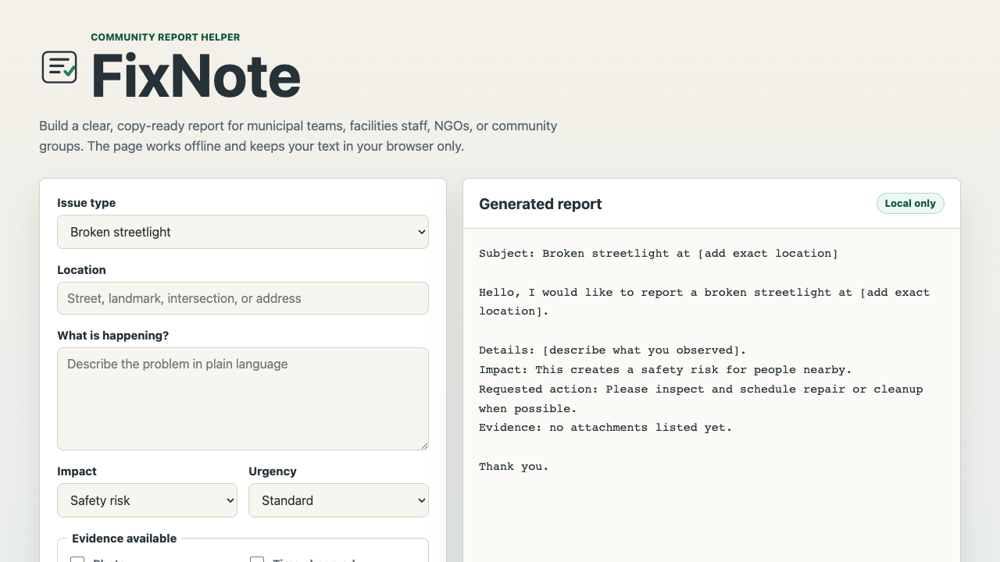

# FixNote

[](https://github.com/lalishka/fixnote/releases)
[](LICENSE)
[](https://lalishka.github.io/fixnote/)
[](https://github.com/lalishka/fixnote/stargazers)

FixNote is a small offline web app that helps people write clear public-space issue reports for municipal teams, campus facilities, building managers, NGOs, and community groups.

It turns messy notes about problems like broken streetlights, potholes, trash, blocked sidewalks, unsafe crossings, and accessibility barriers into a concise report with:

- a short subject line;
- a structured description;
- impact and urgency wording;
- an evidence checklist;
- a copy-ready message.

The project is intentionally not country-specific. It has no backend, accounts, tracking, paid APIs, or external runtime dependencies.

Public repository: <https://github.com/lalishka/fixnote>

Live demo: <https://lalishka.github.io/fixnote/>



## Why

Many public-space reports fail because the message is vague, missing location details, or does not explain the impact. FixNote helps residents, students, tenants, volunteers, and community organizers send cleaner reports without needing to know official wording for any specific country.

## Use Locally

Open `index.html` directly in a browser, or run a local server:

```bash
npm run dev
```

Then open `http://localhost:4173`.

## Verify

```bash
npm test
npm run check
```

The test suite validates the report generation logic with Node's built-in test runner. The maintainer-readiness check verifies the basic contributor, security, documentation, and project-script safety files expected before release.

GitHub Actions workflow files are included for CI and Pages deployment. They are currently manual-dispatch workflows until GitHub-hosted Actions are available for the repository account.

## Maintainer Workflow

FixNote now includes a small OSS-maintenance baseline:

- `CONTRIBUTING.md` for contributor expectations and project boundaries;
- `SECURITY.md` for privacy/security reporting boundaries;
- `ACCESSIBILITY.md` for accessibility baseline, checklist, and known gaps;
- GitHub issue and pull request templates;
- manual-dispatch GitHub Actions CI workflow;
- live GitHub Pages deployment from `main` root;
- `npm run check` for maintainer-readiness checks;
- docs in `docs/` for state, setup, testing, runbook, decisions, next steps, and glossary.
- `docs/OSS_MAINTENANCE.md` for the public OSS maintenance story and current limitations.

## Documentation

Start with [docs/README.md](docs/README.md).

## Roadmap

Current open roadmap issues:

- [#1 Accessibility audit checklist and screen reader smoke pass](https://github.com/lalishka/fixnote/issues/1)
- [#2 Printable report output mode](https://github.com/lalishka/fixnote/issues/2)
- [#3 PWA/offline install readiness review](https://github.com/lalishka/fixnote/issues/3)
- [#4 Translation readiness without country-specific assumptions](https://github.com/lalishka/fixnote/issues/4)
- [#5 Review public-space issue categories](https://github.com/lalishka/fixnote/issues/5)

## License

MIT
